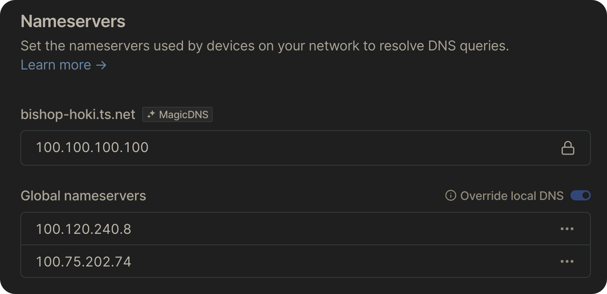

放假这几天来和妈妈住，也一块把小服务器带了过来，但是家里的路由器设置端口映射需要用一个 App，然后我死活登录不上那个 App，于是就有了这段时间的探索。

## Cloueflare Tunnel

由于之前一直是用端口映射，所以还是先考虑通过公网访问。研究一下发现可以利用 Cloudflare Tunnel 将服务器上的应用暴露到公网中（其实最简单的方法应该是 IPv6？但是 Bell 到现在也不支持 IPv6）。其实以前就听说过 Cloudflare Tunnel，这次正好体验一下。

### 安装

在 [Cloudflare One 面板](https://one.dash.cloudflare.com) 里，Access -> Tunnel -> Create a tunnel，输入名字，接下来就到了安装，官方提供了多种安装方式，最简单的应该就是 Docker 了。官方给的 Docker 的命令，但我觉得还是用 Docker Compose 比较方便：

```yaml title="compose.yaml"
version: '3'
services:
  app:
    container_name: coudflare-tunnel
    image: cloudflare/cloudflared:latest
    restart: unless-stopped
    command: tunnel --no-autoupdate run --token <token>

networks:
  default:
    name: front-end
    external: true
```

### Docker 网络

注意到 compose 文件里有一个 front-end 网络，这是一个我们自己创建的 Docker 桥接网络。使用自己创建的桥接网络的一个优点是同一网络中的容器可以用容器名互相访问，因为容器名可以被自动解析到容器的 IP 地址。

### 添加服务

点击创建好的通道 -> Configure -> Public Hostname -> Add a public hostname，Subdomain 和 Domain 根据自己的需求填写即可，Type 选 HTTP，URL 里我们可以直接填`容器名:端口号`（上面提到的）。这样一个服务就配置好了，我们可以通过刚才填的域名来访问该服务了。

### 从桥接网络里访问 Docker Host 网络

如果要添加的服务没有部署在 Docker 容器里，而是直接在操作系统里运行的，我们就需要知道 host 在桥接网络里的 IP 地址了。首先利用 `docker network list` 找到桥接网络的 ID：

```
❯ docker network list
NETWORK ID     NAME                          DRIVER    SCOPE
f3b47c66e2c5   bridge                        bridge    local
c2163ca50a7e   front-end                     bridge    local
96fd97b33b39   host                          host      local
0992cb81726d   none                          null      local
```

然后利用 `ip` 命令找到 host 在桥接网络里的 IP 地址：

```
❯ ip a | grep c2163ca50a7e
35809: br-c2163ca50a7e: <BROADCAST,MULTICAST,UP,LOWER_UP> mtu 1500 qdisc noqueue state UP group default
    inet 172.20.0.1/16 brd 172.20.255.255 scope global br-c2163ca50a7e
```

可以看到我们要找的 IP 地址为 `172.20.0.1`，所以我们在添加服务填写 URL 时就要写`172.20.0.1:端口号`。

用了几天发现 Cloudflare Tunnel 的一大问题是速度很慢（也可能是我家网的原因，但是比其他方案慢很多），而且好像条款里不允许用于流媒体，有被封的风险。

## FRP 代理

然后想到可以利用一个有公网的服务器作为代理来访问内网的服务器。

### Oracle 免费 VPS

以前听说过 Oracle 云有免费的 VPS，但是一直没试过，借这个机会正好嫖一个。免费计划最多可以有两个 VPS，可以是选 x86 或者 ARM 的处理器，x86 的话就只有一个核和 1G 内存，而 ARM 可以最多有四个核和 24G 内存，网速也比 x86 的快很多。存储方面，总共有 200G 的存储空间，但是每个 VPS 至少需要 47G 的启动盘，所以最好还是只保留一个 VPS。

还是想要吐槽一下 Oracle 云的网页非常难用，加载非常慢，而且开启两部验证之后每次登录都要验证，非常耽误时间。

开放端口的话不仅要在网页端上该物理防火墙的设置（参考[此教程](https://dev.to/armiedema/opening-up-port-80-and-443-for-oracle-cloud-servers-j35)），还要在服务器里改 iptables 的设置，前面那个教程里也有，但我这好像不管用，或者直接用

```sh
sudo iptables -I INPUT -j ACCEPT
```

开放所有端口。

### FRP

研究之后发现 FRP 这个软件，用起来很简单，文档里有代理 SSH 的例子，改一下就能代理 HTTP，但网速和 Cloudflare Tunnel 差不多，上传到服务器依然只有不到 1Mbps 的速度（可能与家里网速有关？等会多伦多再试一下）。

## Tailscale

后来无意发现了 Tailscale 这类 mesh VPN 软件，大概就是创建一个虚拟的内网，用 IP 地址就能直接访问网络里的设备。

一开始还是有点不能接受这类方案，感觉可能不如公网访问方便。但由于前两种解决方案性能都不影响，就决定还是先试一试，在配置的过程中逐渐意识到了许多好处：

- 方便：每台设备装一个客户端即可
- 安全：不用开放任何端口，而且网络只有你自己能访问，避免了设置其他的保护措施
- 稳定的网络环境：不论在哪都可以一直访问网络，所以我可以一直用 pihole 解析 DNS
- 可以用作消费级 VPN，保护在外网络的安全

### 配置 Pi-hole 为 DNS 服务器

首先确保本地已经配置好 Pi-hole，然后在 DNS -> Nameservers 里将运行有 Pi-hole 的服务器的地址添加到 Global nameservers 里，然后打开 "Override local DNS"，这样客户端本地的 DNS 设置会被忽略，所有请求将会通过 Pi-hole 解析。



你甚至可以运行多个 Pi-hole 并添加进去以实现负载均衡。

### 与 Nginx Proxy Manager 配合使用

由于 Tailscale 只负责设备与设备之间的链接，如果没有反向代理，访问设备上一个特定的服务时，只能通过指定端口号来访问，不仅不方便记忆而且会被浏览器提示不安全。想要使用 Nginx Proxy Manager 也很简单，对于想用的域名，只要配置一条 CNAME DNS 记录。

比如说我想要用 `file.tgc54.com` 访问运行在名为 home 的设备上的服务，那么我的 DNS 记录应该长这样：


然后在 NPM 里将 `file.tgc54.com` 代理到对应的服务即可。
